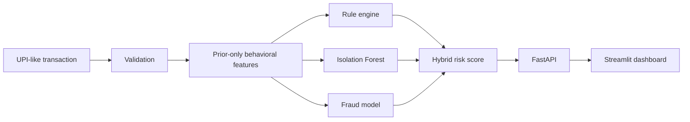

# UPIShield — Behavioral Transaction Anomaly Detection & Risk Scoring

## Overview

UPIShield is an educational fintech ML system that asks: “How unusual is this transaction compared with the user's prior behavior?” It combines transparent rules, an unsupervised Isolation Forest, and a supervised Random Forest into an explainable 0–100 risk score.

> **Dataset disclaimer:** This project uses synthetic UPI-like transaction data generated solely for educational and portfolio purposes. It contains no real NPCI, PhonePe, Google Pay, Paytm, bank, or customer transaction data.

## Key features

- Reproducible 50,000-row simulator (seed 42), behavioral profiles, overlapping fraud/legitimate behavior
- Prior-only user, device, receiver, location, and transaction-velocity features
- Chronological 70/15/15 train/validation/test split; training-only preprocessing
- Rule baseline, Isolation Forest, Logistic Regression/Random Forest comparison, hybrid scoring
- Deterministic explanations, FastAPI, SQLite demo store, Streamlit, PyTest, Render-ready paths

## Architecture



## Data and feature engineering

The simulator creates users with typical amounts, hours, cities, devices, receivers, and categories, then injects probabilistic anomaly scenarios with legitimate overlap. Historical averages, entity novelty, location changes, time gaps, and rolling 10-minute/1-hour/24-hour velocity use only earlier rows. Labels and scenario names are explicitly excluded from model inputs. Cold-start values use neutral defaults.

## Models and temporal strategy

The earliest 70% trains models, the next 15% selects models and thresholds, and the final 15% is evaluated once. Random splitting would let later behavior inform earlier predictions. Isolation Forest is fitted without labels. Logistic Regression and Random Forest are compared by validation PR-AUC; Random Forest was selected. The hybrid weights are 50% supervised probability, 30% anomaly score, and 20% rule score.

Accuracy is misleading at a 2.17% fraud rate because predicting every row as legitimate looks accurate. Precision measures alert quality, recall measures fraud captured, F1 balances them, PR-AUC assesses ranking under imbalance, ROC-AUC assesses overall ranking, and false-positive rate measures legitimate transactions incorrectly flagged.

## Test-set results

| System | Precision | Recall | F1 | PR-AUC | ROC-AUC | FPR |
|---|---:|---:|---:|---:|---:|---:|
| Rule baseline | 0.1000 | 0.1757 | 0.1275 | 0.1146 | 0.7985 | 0.0318 |
| Isolation Forest | 0.0397 | 0.4595 | 0.0731 | 0.0325 | 0.6633 | 0.2238 |
| Random Forest | 0.2231 | 0.3649 | 0.2769 | 0.2267 | 0.7874 | 0.0256 |
| Hybrid engine | 0.2738 | 0.3108 | 0.2911 | 0.2150 | 0.7763 | 0.0166 |

These values come from `python scripts/run_pipeline.py` with seed 42. Full confusion matrices and thresholds are in `reports/metrics.json`.

## Project structure

`src/` contains generation, validation, features, risk logic, modeling, and SQLite code; `scripts/` contains executable workflows; `api/` and `dashboard/` serve the demo; `tests/` verifies correctness; `docs/`, `notebooks/`, `reports/`, and `artifacts/` contain supporting material and outputs.

## Installation and use (Windows)

```powershell
python -m venv .venv
.venv\Scripts\activate
pip install -r requirements.txt
python scripts/run_pipeline.py
pytest -q
```

Run the API with `uvicorn api.main:app --reload` and open `http://127.0.0.1:8000/docs`. Run the dashboard with `streamlit run dashboard/app.py`.

## Render deployment

Create two Web Services from the same repository:

- API build: `pip install -r requirements.txt`; start: `uvicorn api.main:app --host 0.0.0.0 --port $PORT`
- Dashboard build: `pip install -r requirements.txt`; start: `streamlit run dashboard/app.py --server.address 0.0.0.0 --server.port $PORT`
- Set dashboard environment variable `UPISHIELD_API_URL=<deployed FastAPI URL>`.

Alternatively, deploy the included `render.yaml` Blueprint and set `UPISHIELD_API_URL` to the created API service URL.

Artifacts required for inference are committed/deployed with the repository. SQLite is a local/demo read source, not durable cloud storage.

## Limitations and future work

This is an educational system trained on synthetic data, not production fraud infrastructure. Rules and population defaults are simplified; there is no real financial integration, streaming, drift monitoring, or durable Render SQLite. Future work could add approved real data, Kafka, an online feature store, drift monitoring, graph fraud analysis, and GNN research; none is currently implemented.
