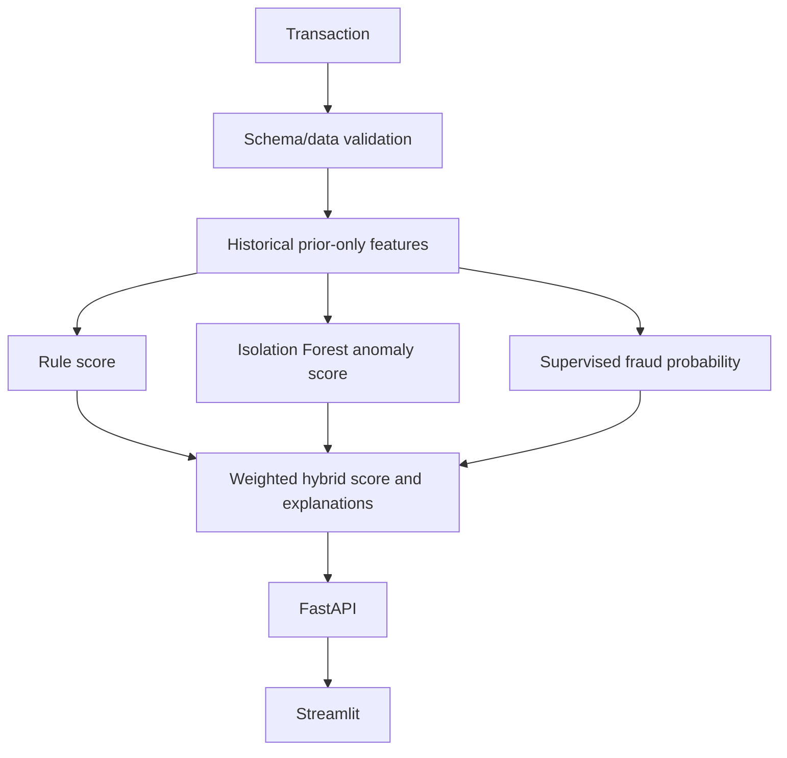

# Architecture

Batch training chronologically generates features, fits preprocessing on training data, uses validation labels for model/threshold selection, and evaluates test data once. API inference retrieves only a user's transactions earlier than the request timestamp and invokes the same feature builder. Unknown users receive neutral cold-start history.

Locally, SQLite supports dashboard/demo history. On Render, API and Streamlit run as separate services from one repository; `UPISHIELD_API_URL` connects the dashboard. Inference depends on packaged artifacts, not persistent SQLite writes.
